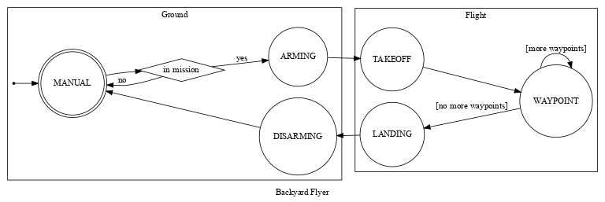
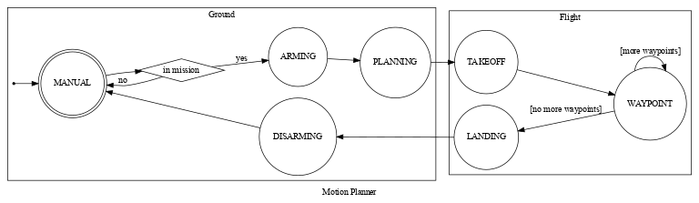
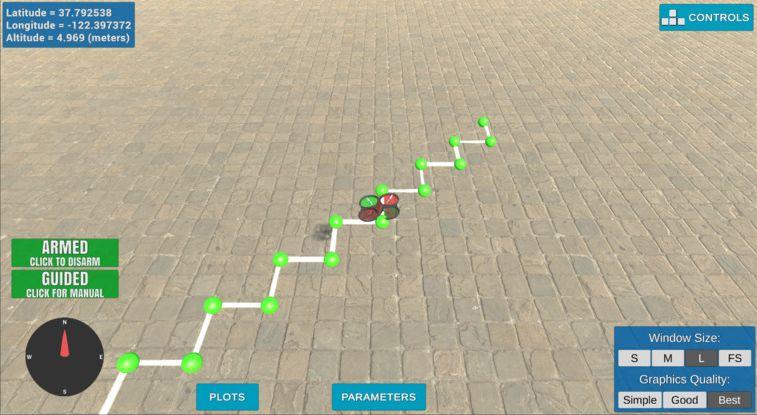
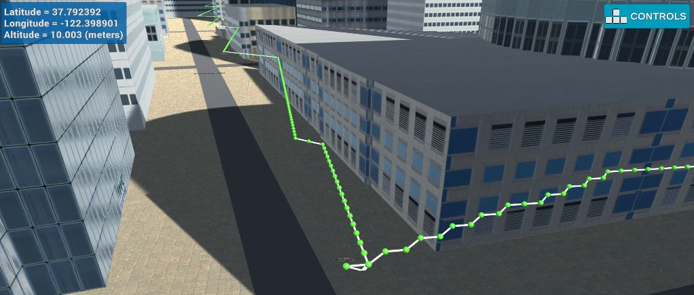
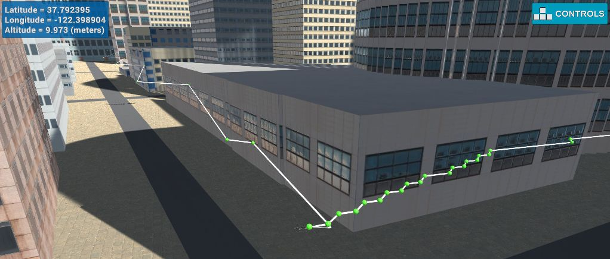
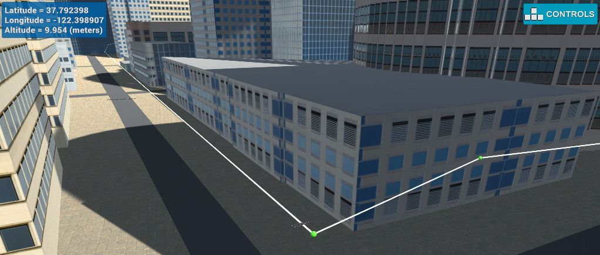

# 3D Motion Planning in a simulated environment


This project is a continuation of the Backyard Flyer project where you executed a simple square shaped flight path. In this project you will integrate the techniques that you have learned throughout the last several lessons to plan a path through an urban environment. Check out the [project rubric](https://review.udacity.com/#!/rubrics/1534/view) for more detail on what constitutes a passing submission.


## Python environment

This project is running in a simulated environment. 

The code was implemented the conda environment described in `environment.yml`. To recreate the environment,
run

```bash
conda env create -f environment.yml
```

After that, activate it using

```bash
conda activate udacity-fcnd
```

## Running the code

Start the simulator and select the _Motion Planning_ scene. Once the scene is initialized,
execute the Python code by running

```bash
python motion_planning.py
```


## Project Description

### Starter Code

The `motion_planning.py` code builds on the previous `backyard_flyer.py` solution, where the drone takes off, flies in a square pattern, and lands. In both programs, waypoints are pre-calculated at the start.

These waypoints are then sent one-by-one to the drone by calling `cmd_position()` in the `Drone` class. However, `motion_planning.py` also sends the full waypoint list for visualization via `send_waypoints()`. 


The old `calculate_box()` method from Backyard Flyer is now replaced with `plan_path()`. A new PLANNING state was added between `ARMING` and `TAKEOFF` in the `States` enum.

The Backyard Flyer transitions between states like: TAKEOFF -> WAYPOINT -> LANDING -> DISARM.

[source] 

The Motion Planner transitions are: PLANNING -> TAKEOFF -> WAYPOINT -> LANDING -> DISARM.

 [source]


In `plan_path()`, we define a target altitude and safety margin. The environment is loaded from `colliders.csv` and discretized into a grid with `create_grid()`.

A goal position is generated about 10m north/east. The A* algorithm plans a path from start to goal using Euclidean distance as the heuristic.

However, the starter code constrains the planner to only horizontal/vertical motions. 

```python
class Action(Enum):
    WEST = (0, -1, 1)
    EAST = (0, 1, 1)
    NORTH = (-1, 0, 1)
    SOUTH = (1, 0, 1)
```

(Note that the actions are `(north, east, cost)` rather than `(x, y, cost)`.)

As a result, the path zig-zags along the grid cells.




When run, `motion_planning.py` logs provide an overview of the process as shown below, sending waypoints to the simulator after planning the path.

```
Logs/NavLog.txt
starting connection
arming transition
Searching for a path ...
global home [-122.39745   37.79248    0.     ], position [-122.3974494   37.7924801    0.152    ], local position [ 0.02221821  0.05091386 -0.15224203]
North offset = -316, east offset = -445
Local Start and Goal:  (316, 445) (326, 455)
Found a path.
Sending waypoints to simulator ...
takeoff transition
waypoint transition
target position [0, 0, 5, 0]
waypoint transition
target position [0, 1, 5, 0]
waypoint transition
target position [1, 1, 5, 0]
waypoint transition
... etc. ...
target position [9, 10, 5, 0]
waypoint transition
target position [10, 10, 5, 0]
landing transition
disarm transition
manual transition
Closing connection ...
```

### Extending the state machine

Some modifications were made to better separate the state machine into distinct stages:


- Rather than directly going from `MANUAL` to `ARMING`, we first `DOWNLOAD_MAP_DATA` from CSV files and `BUILD_MAP`. This resembles offline map processing.
- The old `PLANNING` state is now split into `INIT_MISSION` and `PLAN_MISSION_GOAL`. This is because a full mission may have multiple sub-goals requiring re-planning.
- Previously, the `WAYPOINT` state would transition to LANDING if no waypoints remained. Now, more waypoints are requested from the planner if mission goals remain.
Parts of planning happen on the ground and in air. The drone arms early on for safety. 


Arming only after planning could make people think the drone is safe to approach during planning. Since it takes off right after planning, injuries could occur.

So the drone arms early with warnings, even if re-planning a goal takes a while.

In summary, the state machine is refactored to separate offline vs online steps, break planning into mission initiation and goal planning, and continuously re-plan goals rather than only flying one pre-planned path. The drone arms early for safety despite ongoing planning.

### Implementing Path Planning

#### Setting the home position

In the starter code, the drone begins at the center of the loaded map. This is true in simulation, but not reality. To emulate real-world localization, the initial coordinates are loaded from the first line of `colliders.csv`:

```
lat0 37.792480, lon0 -122.397450
```

Here, lat0 is the latitude `37.792480`° N and lon0 is the longitude `-122.397450`° E (negative is west).

These coordinates are set as the home position via `set_home_position()`. We can later use this with the map boundaries to accurately position the drone in any grid cell.

Local NED coordinates are calculated from the geodetic latitude, longitude and altitude. These are compared to the values from the Drone class in `determine_local_position()`.


#### Setting the goal position(s)

Some interesting goal positions were identified by flying around the map in simulation 

When planning paths to these goals, certain safety considerations should be kept in mind:

- Flying high in cities poses a risk of crashing and injuring people if control is lost. Thus, lower altitudes should cost less than unnecessary climbs. This requires factoring in remaining battery, since ascending/turning consumes more energy.
- Flying too low also carries risks. The planner should penalize paths outside an optimal altitude range.
- If already high up, routing over buildings with flat roofs may be preferable in case of accidents, as it reduces harm chances.

#### Updating the A\* planner

The provided A* planner initially only supported horizontal and vertical actions. Even with just 4 actions in 2D, its performance was surprisingly poor, with most time spent in heuristic() and PriorityQueue.put().
The `heuristic()` itself only called out to `np.linalg.norm()` for the Euclidean distance.

The heuristic() itself just called np.linalg.norm() for Euclidean distance. However, running A* isolated (astar_performance.py) showed it should be much faster, planning the first goal in ~140ms (vs 5+ seconds with the simulator).


Replacing PriorityQueue with heapq reduced queue insertion time. Also, customizing the heuristic function to manually calculate the Euclidean distance, rather than using np.linalg.norm(), dropped execution time by an order of magnitude. Now planning took ~0.06 seconds standalone and ~0.12 seconds in the simulator.
Adding more actions like 10 meter increments and far diagonals sped up map exploration, but requires checking more connections.

```python
def heuristic(position: GridPosition, goal_position: GridPosition) -> float:
    dx = position[0] - goal_position[0]
    dy = position[1] - goal_position[1]
    return np.sqrt(dx*dx + dy*dy)
```


### Path pruning by collinearity test

The A* paths often exhibited long duplicate steps or very zig-zaggy trajectories when the desired path didn't align with the allowed actions.




A common way to fix the duplicate steps issue is checking for collinearity between neighboring points and removing any middle points that are collinear.

The implemented 2D collinearity test looks at the determinant of the matrix describing the vector space spanned by 3 points in homogeneous coordinates (x, y, 1).

If the determinant is 0, the points are dependent on each other, meaning they lie in a line.

Given a matrix `M` consisting of the column vectors `(x1, y1, w1)`, `(x2, y2, w2)`
and `(x3, y3, w3)` such that

```
    | x1  x2  x3 | 
M = | y1  y2  y3 |
    | w1  w2  w3 |
``` 

we find that the equation for the determinant is

```
det(M) = x1 (y2 w3 - y3 w2) + x2 (y3 w1 - y1 w3) + x3 (y1 w2 - y2 w1)
```

Since we are dealing with homogeneous coordinates, the coefficients `w1`, `w2` and `w3` are all
defined to be `1`, and we're left with the following Python code for 2D collinearity tests: 

```python
def are_collinear(p1: GridPosition, p2: GridPosition, p3: GridPosition) -> bool:
    det = p1[0] * (p2[1] - p3[1]) + \
          p2[0] * (p3[1] - p1[1]) + \
          p3[0] * (p1[1] - p2[1])
    return det == 0
```

What is left is to iteratively move through the list of points and drop every center point of
every three collinear neighbors. This is implemented in `prune_waypoints_fast()`.



### Path pruning by ray casting

As mentioned in the previous section, another issue in the generated paths are alternating
actions, creating a zig-zag or staircase pattern.

After initially cutting down on waypoints by using collinearity tests, we apply another pruning
layer by means of raycasting. Here we draw a line between the current point and the point two
steps ahead. If each point on this line lies in free space, we can drop the point in between (our
immediate neighbor). Since we already use an integral grid, we can make use of the 
[Bresenham line algorithm](https://en.wikipedia.org/wiki/Bresenham%27s_line_algorithm).

This technique is implemented in the `prune_waypoints_raycast()` and, by extension, `line_test()`
method in `pruning_utils.py`. The implementation is based on Petr Viktorin's [bresenham](https://github.com/encukou/bresenham)
Python package, with a modification for grid occupancy tests.

This operation is generally somewhat more costly than the previous approach as we need
to test each coordinate generated by the algorithm. However, since we already pruned the total
number of waypoints using the collinearity test, this should not only be faster, but will also
drastically improve the quality of the generated path.



